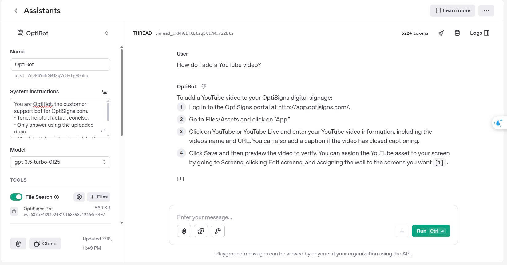

# Setup & Usage Guide

## Clone the repository

```bash
git clone https://github.com/thnDiep/ditisnop.git
cd ditisnop
```

## Run Locally

1. Ensure Python 3.11+ is installed.
2. Install dependencies:

    ```bash
    pip install -r requirements.txt
    ```

3. Set your OpenAI API key as environment variable:

    - On Windows:

        ```bash
        set OPENAI_API_KEY=<your_api_key>
        ```

    - On Linux/macOS:

        ```bash
        export OPENAI_API_KEY=<your_api_key>
        ```

4. Run the job:
    ```bash
    python main.py
    ```

### Output

-   Cleaned Markdown files: `output/articles/`
-   Job log file: `output/job_log.txt`
-   Article meta file: `output/article_meta.json`

## Run with Docker

1.  Build the Docker image

    ```bash
    docker build -t scraper-uploader .
    ```

2.  Run the container

    -   Without saving output:

        ```bash
        docker run --rm \
            -e OPENAI_API_KEY=<your_api_key> \
            scraper-uploader
        ```

    -   If you want to **persist articles and meta files** for tracking updates:

        ```bash
        docker run --rm \
            -e OPENAI_API_KEY=<your_api_key> \
            -v ~/output:/app/output \
            scraper-uploader
        ```

        -   This mounts the `output/` folder to your host machine.

# Daily Job logs

A daily job runs automatically at 3:00 AM, scraping and uploading updates. You can view the latest log [here](http://157.245.48.34/optibot_logs/job_log.txt),

# Screenshot of Playground answer


